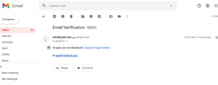

# Final Team Project Description 
In this project we developed one unique feature per team member and integrated it into the database created 
during this course. The two features as seen in the screenshots below, is the ability to create a graph using the data
and an email verification process. 

The application was setup with Docker-compose, Flask, and MySQL

## Team Members
Azra Awan and Dalitza Sanchez

### Installation
The app can be cloned from the git repository and started with a simple docker-compose up command.

### Description
The app will utilize sendgrid-in/ sign-up functions as well as perform some arithmetic and stats functions while 
charting the output using the Chartist.js, and Flask libraries. 

###  Features
#### Image of Chart
Our app is able to run and return charts to quantify the data.

### Email and Registration Capacity
Our application is equipped with email verification. Below is a screenshot of the partial verification process. 

This screenshot shows the image of invalid or incorrect password response from the application.  

