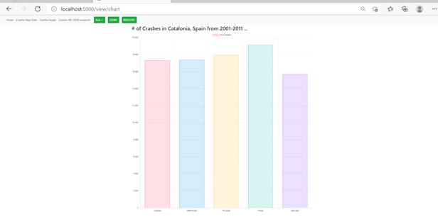
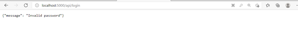

# Final Team Project Description 
In this project we developed one unique feature per team member and integrated it into the database created 
during this course. The two features as seen in the screenshots below, is the ability to create a graph using the data
an email verification process. 

## Team Members and link to project
Azra Awan and Dalitza Sanchez

[Final Team Project](https://github.com/afa48/FinalTeamProject/tree/master)

# Project Description 
This team project teaches us how to setup Pycharm with Docker, Flask, and MySQL using csv data.
Once our data was setup, we developed the following two features:

I. Add a chart from chart.js to incorporate our api data from the json endpoints. 

II. Create a login and registration process that includes email verification from SendGrid. 

Installation Instructions for Using the App with Docker:
1. Make sure docker desktop is installed on your computer.
2. The Git Repository can be cloned into Pycharm. 
3. Make sure Docker is connected, the Language for the project is set to MySql, Edit Configurations to Docker Compose File and Interpreter is Setup. 
4. When setting up the code, add an .env file under app directory after downloading the repository. 
5. The .env file will need one variable called SENDGRID_API in order for flask app to function. 

Feature I: Using Chart.js to display API JSON Data 
The Graph will display json data from our api endpoint. 
When Adding new Data, Editing Data, Deleting Data, the Crashes graph will incorporate this data into its results. 
The graph will reflect any changes made to the data on the crashes chart. 

Feature II: Email Login/Registration Process
Registration - Indicate your email and password. 
Once a username and password are entered, then you will be redirected to the homepage. 
You will also receive an email to the registered address indicating registration is complete. 
Login - Using the same email and password, - login to the account. 
Once logged in, you will be redirected to the homepage. 
During Registration and Login process, the server will validate your input and send back error messages if information is incorrect. 
Please observe network tab in your browser for any error messages. 

This screenshot shows the image of invalid or incorrect password response from the application.  

